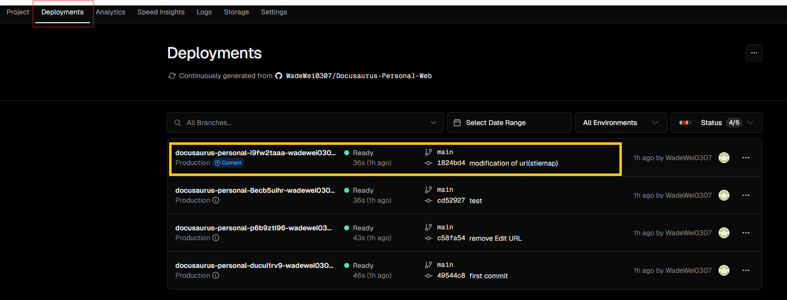

## <font color = "red">Docusaurus官方網站</font>
1. 先至[官方網站](https://docusaurus.io/docs)找到下圖指令輸入，便可以創建好資料夾。

:::note
- 這邊要注意的是Node.js版本必須 >= 18.0
- 如何切換我們的Node版本可以參考下圖指令方式

- 如果出現紅色框框的error，可以用系統管理員開啟你的CMD就可以解決了喔！
:::
2. 接著到指定的資料夾並且執行以下的程式便可以打開預設的網頁了喔！
```shell showLineNumbers
cd my-website
npx docusaurus start //or below instruction
npm run start
```
## <font color = "red">利用Vercel佈署網站</font>
1. 首先我們先到[Vercel官方網站](https://vercel.com/)，註冊過後可以到下圖的畫面。


2. 接著我們按下紅色框框裡並且選擇Project。
:::note
- 在第三步之前，必須先將你剛剛創建好的Docusaurus專案上傳到Github上喔！
:::
3. 再來我們Link到我們的Github專案，並且選擇你的Docusaurus專案。


4. 接著我們就按下Deploy，並且可以點選下圖紅色方框來查看我們是否已經Deploy完成。



5. 如果佈署成功後，我們可以點選上途中黃色方框，接著點選下圖的Visit，就可以看到剛剛你設計的網站了喔！


<font size="20">**大功告成，恭喜恭喜** </font>

參考來源：[Youtube大神](https://www.youtube.com/watch?app=desktop&v=NpoaHl380DM&ab_channel=WeiWei)