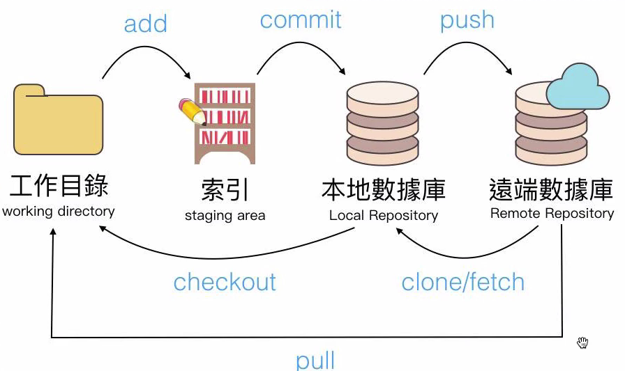

## 1. Git 整體架構
- 首先大致架構為如下圖 (來源為[六角學院](https://www.hexschool.com/ "hex school"))


- 在Git下版控的檔案會有以下這些狀態 (來源為[六角學院](https://www.hexschool.com/ "hex school"))


:::note
- Changes to be committed: 已加入索引，隨時可被Commit。
- Changes not staged for commit: 曾經就已經存在Git版控資料夾下的檔案，只是被修改過。
- Untracked file: 初來乍到此Git版控資料夾下的檔案
:::
### 1. Git 初始化數據庫 - git init

```shell
git init
```
- 可以看到該資料夾下會多一個.git檔案。
- 即為新增為本地數據庫。

### 2. 查看工作目錄上有什麼檔案 - git status

```shell
git status
```
- 會顯示出 <font color = "red">**untracked file**</font>，表示這些檔案還未被加入到索引。

### 3. 將檔案加入到索引區 - git add

```shell
git add <.> //.預設為全部untracked file, 也可以"指定檔案"
```

:::note
- 這時候在下一次 <code>git status</code>，會發現檔案變成出現在<font color = "red">**changes to be commited**</font>裡面，也就是已經到索引區了。
:::

### 4. 將檔案加入到本地數據庫 - git commit

```shell
git commit -m <"abc">  //abc為你為這次新增的檔案目的
```
- 下了這行之後，檔案就已經被新增到本地數據庫了喔！

### <div id = "jump1">5. 查看Commit後的紀錄 - git log</div>

```shell
git log
```
:::note
- 按'q'可以退出下圖的編輯模式。
:::

- 可以看到每次的Commit紀錄，也會有作者資訊。


### 6. 新增遠端數據庫 - git remote

```shell
git remote add <origin> <URL> //URL https://github.com/WadeWei0307/Git_test.git 通常為Github新增Respository後他給你的範例網址 
```

- 那新增完之後可以去 **.git/config** 的檔案確認是否已新增遠端數據庫。


- origin 為遠端URL的名字。

```shell
git remote
//origin
```

- 可以看到目前遠端數據庫有幾個命名的名稱，以上面那行為範例的話會出現 origin。

```shell
git remote -v
```

- 可以看到遠端數據庫的名稱+URL

### 7. 將檔案新增至遠端數據庫 - git push

```shell
git push -u origin main
```

- 這邊 <code>-u</code> 的意思是當我曾經推上遠端數據庫名為main之後，我下次還要將本地推到遠端main分支的時候只需要下 <code>git push</code>。
- 可解讀為推至origin上的main branch。

### 8. 從遠端數據庫抓資料回工作目錄 - git pull

```shell
git pull
```

- 會將遠端分支目前所在點的資料同步抓回工作目錄。

### 9. 複製他人專案至本地電腦工作目錄 - git clone

```shell
git clone <URL>
```

- URL 通常為Github的網址。

### 10. 從遠端數據庫抓資料回本地數據庫 - git fetch

```shell
git fetch <Remote Repository> <Branch name> //Ex: git fetch origin master
```

- 會在Local端形成與遠端數據庫一模一樣的分支，但還不會與工作目錄上進行合併。

:::note
Git pull, Git clone, Git fetch差異
1. Git pull: 其實=Git fetch + git merge，會直接更新Local分支到與遠端數據庫分支一樣的狀態。
2. Git clone: 第一次下載他人專案至本地工作目錄。
3. Git fetch: 只會先將遠端數據庫與本地數據庫不一樣的部分抓至本地數據庫，但還不會進行Merge的動作，工作目錄尚未更新。
:::

### 11. 在Local退回某筆Commit的狀態 - git checkout

- 可以透過<code>git log</code>[看到每次Commit會有一個編號](#jump1)，再透過此指令跳至該筆Commit後的狀態。
- 以上圖為範例，我要跳至 "add git tutorial" 這個commit點，可以透過下方指令。

```shell
git checkout 02e7f2b
```

- 透過下圖可以看到，我們的HEAD指標已經跳到該Commit紀錄上。


:::note
- 這邊要注意的是，我們只是先將HEAD移動到該筆Commit紀錄上，並不表示我們的遠端數據庫也已經被改成該筆紀錄的狀態。
:::

- 要回到原先的Main點上則可以透過下方指令。

```shell
git checkout main
```

## 2. Git分支

### 1.創建分支 - Git branch

```shell
Git branch dev //創建一支新的分支名叫dev
```

- 可以用<code>Git branch</code>查看現在所有的分支。

### 2. 分支合併 - Git merge
#### a. 不會產生額外的Commit

- 以下圖為例，Head指標現在指在Master分支上，想要Master分支也擁有Dev分支的狀態，可以使用<code>Git merge</code>。


```shell
Git merge dev
```


:::note
- 如果想要將Master也擁有Dev分支的屬性，一定要記得先將Head指標Checkout到Master上。
:::

- Merge完之後，可以看到Master已經合併到Dev上了。


:::note
- 可以透過[<code>git log</code>](#jump1)查看Head指標在什麼分支上。
:::


#### b. 會產生額外的Commit
- 假設兩個分支上彼此擁有各自的Commit紀錄，則此時圖會如下圖。


- 此時Head跳至Master並且Merge Dev，就會額外產生一個Commit點，如下圖。


:::note
- 如果當初是<code>Git merge master</code>，那麼結果只會是兩個分支的前後順序不一樣而已，其他並沒有什麼區別。
:::

:::tip
- 也可以強制讓Merge有多出一個Commit紀錄。 <code>git merge master --no-ff</code>
:::


## 3. 查看Git版本 - git version

```shell
git --version
```
- cmd會Show出Git的版本。

## 4. 設定作者 - git config

```shell showLineNumbers
git config --global user.name <"gonsakon">
git config --global user.email <"gonsakon@gmail.com">
git config --list
```
- Line 1 就是作者名稱 (下圖紅框，[Source Tree](https://www.sourcetreeapp.com/)的頁面)
- Line 2 就是作者信箱 (下圖紅框，[Source Tree](https://www.sourcetreeapp.com/)的頁面)
- Line 3 可以查看剛剛是否有設定進去。

:::note
Line 3 也可以去 C:\Users\<user> 底下的.gitconfig做查看。
:::


### 1. Git指令指定縮寫  

```shell
git config --global alias.st status
```

- 要如何看自己有沒有改成功，可以輸入<code>git config --list</code>之後查看。
 