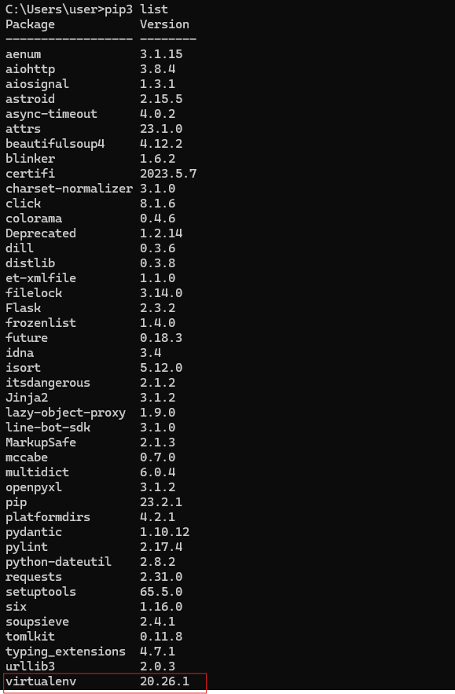
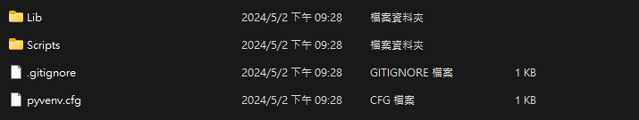
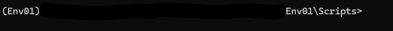
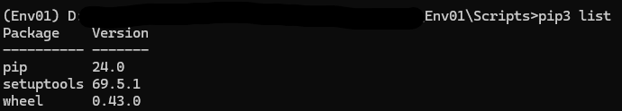
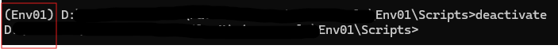

## 1. 檢查pip版本
- 首先，建議先把pip升級成最新版本。
```shell showLineNumbers
pip3 list
pip3 install --upgrade pip
```
- 這樣我們就完成pip的升級了喔！

## 2. 安裝virtualenv
- 首先，可以透過下面指令來安裝。
```shell showLineNumbers
pip3 install virtualenv
```
- 再來可以透過下面指令來確定是否安裝成功。
```shell showLineNumbers
pip3 list
```


## 3. 建立Python虛擬環境
- 首先可以先創建一個自己喜歡的資料夾，然後到此目錄下開啟CMD。
- 接著，輸入下列指令即可以創建好虛擬環境喔！
```shell
virtualenv Env01 //Env01 is the name you like
```
- 可以看到資料夾目錄架構大概會是如下圖。

- 那接著，我們到Scripts目錄下並且輸入下列指令。
```shell
activate
```
- 會可以看到CMD在最前面，會是你剛剛創建虛擬環境的名字。

- 到這步虛擬環境已經成功建立了喔！這時一樣可以確認虛擬環境的套件是否與系統變數下的套件不一樣。

- 可以發現比原本環境的套件還少很多唷！
:::note
- 可以參考第二步的圖片喔！
:::
- 這時就可以開始安裝你想在此虛擬環境下所想用的套件了。

## 4. 關閉Python虛擬環境
- 那麼關閉虛擬環境只需要一行指令。
```shell
deactivate
```
- 可以發現路徑前面的虛擬環境名稱不見了，那就表示已經關閉了喔！


:::info
- 以上資訊是參考這個[網頁資訊](https://simplelearn.tw/python-virtualenv/)喔！
:::